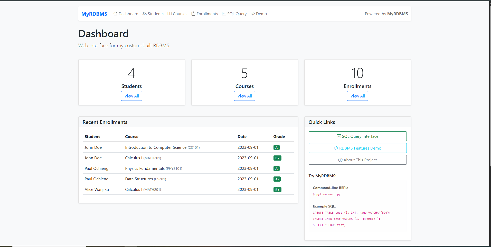

# MyRDBMS - A minimal relational database management system

 
 
 


## Overview

**MyRDBMS** is a fully functional relational database management system implemented from scratch in Python. Unlike typical database projects that rely on existing engines such as SQLite or MySQL connectors, this project builds the core database components directly, including:

- Storage engine with file persistence  
- SQL parser for SQL-like queries  
- Query executor with basic optimization  
- Type system with strict validation  
- Hash-based indexes indexing system for faster queries  
- Interactive REPL (Read-Eval-Print Loop)  
- Web interface with full CRUD operations  

The project was developed as a hands-on demonstration of database system internals, design tradeoffs, and practical software engineering skills.

### <ins>[Live Demo using a Web App](https://myrdbms.pythonanywhere.com/)</ins>


## Features

### ✅ Core RDBMS Features

- **SQL-like Query Language**  
  Supports `CREATE`, `INSERT`, `SELECT`, `UPDATE`, and `DELETE`

- **Data Types**  
  `INT`, `VARCHAR(n)`, `TEXT`, `DATE`, `FLOAT`, `BOOL`

- **Constraints**  
  `PRIMARY KEY`, `UNIQUE`, `NOT NULL`

- **Indexing**  
  Basic hash-based indexing for faster lookups

- **Joins**  
  `INNER JOIN` operations across multiple tables

- **File Persistence**  
  Database state saved to disk using pickle serialization

---

### ✅ Interface Features

- **Interactive REPL**  
  Command-line SQL interface for direct database interaction

- **Web Application**  
  Flask-based web interface for managing data

- **CRUD Operations**  
  Create, Read, Update, and Delete records through web forms

- **Real-time Query Execution**  
  Execute raw SQL queries directly from the web interface

- **API Endpoints**  
  JSON-based API for programmatic access

---

### ✅ Advanced Features

- **Error Handling**  
  Clear and descriptive error messages

- **Data Validation**  
  Strict type checking and constraint enforcement

- **Query Optimization**  
  Basic index usage during query execution

- **Multi-table Operations**  
  Support for complex joins and relationships

- **Sample Data Generation**  
  Automatic generation of test data for development and demos

---

## Architecture

### System Components

```text
┌────────────────────────────────────────────────────────────┐
│                MyRDBMS Architecture                        │
├────────────────────────────────────────────────────────────┤
│  ┌─────────────┐                 ┌─────────────┐           │
│  │   Web App   │                 │    REPL     │           │
│  │   (Flask)   │                 │   (CLI)     │           │
│  └──────┬──────┘                 └──────┬──────┘           │
│         │                                │                 │
│  ┌──────▼──────┐                 ┌──────▼──────┐           │
│  │   Routes    │                 │   Parser    │           │
│  │   Forms     │                 │   Executor  │           │
│  └──────┬──────┘                 └──────┬──────┘           │
│         │                               │                  │
├─────────┼───────────────────────────────┼──────────────────┤
│         │                               │                  │
│  ┌──────▼───────────────────────────────▼──────┐           │
│  │               Query Executor                │           │
│  └───────────────────┬─────────────────────────┘           │
│                      │                                     │
│       ┌──────────────▼───────────────┐                     │
│       │          Storage Engine      │                     │
│       │  • Schema Management         │                     │
│       │  • Data Persistence          │                     │
│       │  • Index Management          │                     │
│       │  • Constraint Enforcement    │                     │
│       └──────────────┬───────────────┘                     │
│                      │                                     │
│       ┌──────────────▼───────────────┐                     │
│       │           File Storage       │                     │
│       │      (Pickle Serialization)  │                     │
│       └──────────────────────────────┘                     │
└────────────────────────────────────────────────────────────┘
```

## Data Flow

- **SQL Parsing**  
  SQL string → Abstract Syntax Tree (AST)

- **Query Execution**  
  AST → Storage operations

- **Storage Operations**  
  Schema validation → Data manipulation

- **Persistence**  
  In-memory structures → File serialization

---

## Installation

### Prerequisites

- Python 3.8 or higher  
- pip (Python package manager)

### Step-by-Step Installation

```bash
# 1. Clone the repository
git clone https://github.com/Polceze/MyRDBMS.git
cd MyRDBMS

# 2. Create virtual environment (recommended)
python -m venv venv

# 3. Activate virtual environment
# On Windows:
venv\Scripts\activate
# On Mac/Linux:
source venv/bin/activate

# 4. Install dependencies
pip install flask

# 5. Verify installation
python --version
pip list
```

## Quick Start

### Option 1: Command-Line Interface (REPL)

```bash
# Start the interactive SQL shell
python main.py
```
**Example REPL session:**
```sql
sql> CREATE TABLE users (id INT PRIMARY KEY, name VARCHAR(50), age INT);
sql> INSERT INTO users VALUES (1, 'Alice', 25);
sql> SELECT * FROM users;
sql> CREATE INDEX idx_name ON users(name);
sql> SELECT * FROM users WHERE name = 'Alice';
sql> exit
```

### Option 2: Web Interface
```bash
# 1. Initialize the database with sample data
python -m flask --app web_main init-db

# 2. Start the web server
python web_main.py

# 3. Open your browser and navigate to:
# http://localhost:5000
```
## Usage Examples

### Basic SQL Operations
```sql
-- Create a table with constraints
CREATE TABLE employees (
    emp_id INT PRIMARY KEY,
    name VARCHAR(100) NOT NULL,
    department VARCHAR(50),
    salary FLOAT,
    hire_date DATE,
    active BOOL
);

-- Insert data (positional)
INSERT INTO employees VALUES (1, 'John Doe', 'Engineering', 75000.50, '2020-01-15', true);

-- Insert data (with column names)
INSERT INTO employees (emp_id, name, department, salary) 
VALUES (2, 'Jane Smith', 'Marketing', 65000.00);

-- Select with WHERE clause
SELECT * FROM employees WHERE salary > 70000;

-- Update records
UPDATE employees SET salary = 80000.00 WHERE emp_id = 1;

-- Delete records
DELETE FROM employees WHERE active = false;

-- Create an index
CREATE INDEX idx_department ON employees(department);
```

### JOIN Operations

```sql
-- Create related tables
CREATE TABLE departments (
    dept_id INT PRIMARY KEY,
    dept_name VARCHAR(50),
    location VARCHAR(50)
);

CREATE TABLE department_employees (
    id INT PRIMARY KEY,
    emp_id INT,
    dept_id INT
);

-- Perform INNER JOIN
SELECT employees.name, departments.dept_name
FROM employees
INNER JOIN department_employees ON employees.emp_id = department_employees.emp_id
INNER JOIN departments ON department_employees.dept_id = departments.dept_id;
```


## Web Interface

### Dashboard

The dashboard provides an overview of your database, including key statistics and quick access to all major features.



---

### Features Accessible via Web Interface

#### Students Management
- List all students with search and filter options  
- Add new students  
- Edit existing students  
- Delete students  

#### Courses Catalog
- Browse available courses  
- Search by course name, code, or instructor  
- Add new courses via a dedicated form  
- Delete courses  

#### Enrollments
- View all student–course enrollments  
- Enroll a student in a course via a modal form (with student/course dropdowns, date picker, and optional grade)  
- Update a student's grade inline directly from the enrollments table  
- Remove individual enrollments  
- Demonstrates `INNER JOIN` operations across three tables  
- Automatically removes a student's enrollments when the student is deleted  

#### SQL Query Interface
- Execute raw SQL queries  
- View results in a tabular format  
- Example queries provided  
- Clear error handling and feedback  

#### RDBMS Demo
- Live demonstration of database features  
- Displays actual SQL queries and results  
- Explains system architecture and behavior  

## API Endpoints

```javascript
// Execute SQL query via API
POST /api/query
Content-Type: application/json

{
  "sql": "SELECT * FROM students WHERE enrollment_year = 2024"
}

// Response
{
  "success": true,
  "result": [
    {
      "student_id": 1,
      "first_name": "John",
      "last_name": "Doe",
      "email": "john.doe@example.com",
      "date_of_birth": "2000-05-15",
      "enrollment_year": 2024
    }
  ]
}
```

## API Reference

### Storage Engine (rdbms.storage.StorageEngine)

```python
class StorageEngine:
    def __init__(self, db_file='database.db')
    def create_table(table_name, columns, primary_key=None, unique_keys=None)
    def insert(table_name, values_dict)
    def select(table_name, columns='*', where=None, join=None)
    def update(table_name, set_values, where=None)
    def delete(table_name, where=None)
    def create_index(table_name, column_name)
    def load()  # Load from file
    def save()  # Save to file
```

### Query Executor (rdbms.executor.QueryExecutor)

```python
class QueryExecutor:
    def __init__(self, db_file='database.db')
    def execute(parsed_query)  # Execute parsed query
    def execute_raw(sql)       # Parse and execute SQL string
```

### SQL Parser (rdbms.parser.SQLParser)

```python
class SQLParser:
    @staticmethod
    def parse(sql)  # Parse SQL string into AST
```


## Project Structure

```text
MyRDBMS/
├─ Assets/
│  └─ dashboard.PNG
├─ rdbms/
│  ├─ __init__.py
│  ├─ executor.py
│  ├─ parser.py
│  ├─ repl.py
│  ├─ storage.py
│  └─ types.py
├─ tests/
│  ├─ check_result_format.py
│  ├─ debug_executor.py
│  ├─ simple_test.py
│  ├─ test_all_aggregates.py
│  ├─ test_join_queries.py
│  ├─ test_multiple_joins.py
│  └─ test_positional_insert.py
├─ web_app/
│  ├─ templates/
│  │  ├─ courses/
│  │  │  ├─ add.html
│  │  │  └─ list.html
│  │  ├─ enrollments/
│  │  │  └─ list.html
│  │  ├─ students/
│  │  │  ├─ add.html
│  │  │  ├─ edit.html
│  │  │  └─ list.html
│  │  ├─ demo.html
│  │  ├─ index.html
│  │  ├─ layout.html
│  │  └─ query.html
│  ├─ __init__.py
│  ├─ db.py
│  └─ routes.py
├─ .gitignore
├─ LICENSE
├─ main.py
├─ README.md
├─ requirements.txt
└─ web_main.py
```

## Testing

**Running the Tests Scripts**
```bash
# Run specific test file
python -m tests.test_file_name 

# Specific example
python -m tests.simple_test # safe to leave out .py (file extension)

```

## Limitations

### Current Limitations

**Database Engine:**
- Single-file Storage: All data stored in one file, no paging or sharding
- No Foreign Key Constraints: Referential integrity is not enforced
- Basic Indexing: Simple hash-based indexes instead of B-trees
- No Concurrency Control: Single connection at a time
- Basic Error Recovery: Limited crash recovery support

**SQL Syntax Support:**
- Limited SQL Syntax: Subset of SQL only
- No table or column aliases (e.g., `SELECT s.name FROM students s`)
- No subqueries or views
- No GROUP BY or HAVING clauses
- No prepared statements or query caching
- JOINs require explicit table prefixes in column references (e.g., `students.first_name` not just `first_name`)
- WHERE clauses don't support parentheses or complex expressions
- No support for LEFT/RIGHT/FULL OUTER JOIN, only INNER JOIN

**Data Types & Features:**
- Limited data type support (no BLOB, DECIMAL, TIMESTAMP, etc.)
- No transactions
- No stored procedures

### Known Issues

**Performance:**
- All data is stored in memory and serialized to disk
- No query optimization
- No connection pooling in web interface

**Web Interface:**
- Database is recreated on every app restart in development mode
- No user authentication
- SQL injection vulnerabilities exist in raw query interface (educational purpose only!)
- No foreign key cascade support in the storage engine — referential integrity is handled at the application layer (e.g., deleting a student also deletes their enrollments)

**SQL Feature Gaps:**
- Table aliases not supported - must use full table names
- Column aliases (AS keyword) not fully supported
- Complex JOIN conditions (only simple equality supported)
- Limited error messages for malformed SQL

### Getting Around Limitations

For JOIN queries, always use full table names:
```sql
-- ✅ DO: Use table prefixes
SELECT students.first_name, courses.course_name, enrollments.grade
FROM enrollments
INNER JOIN students ON enrollments.student_id = students.student_id
INNER JOIN courses ON enrollments.course_id = courses.course_id;

-- ❌ DON'T: Use table aliases  
SELECT s.first_name, c.course_name, e.grade
FROM enrollments e
INNER JOIN students s ON e.student_id = s.student_id
INNER JOIN courses c ON e.course_id = c.course_id;
```

## Future Improvements

### Short-term Goals

- **Foreign Key Support**  
  Enforce referential integrity between tables

- **B-tree Indexes**  
  Replace hash-based indexing with proper B-tree structures

- **Query Caching**  
  Cache parsed queries for reuse

- **Export and Import**  
  Support CSV and JSON data exchange

---

### Long-term Vision

- **Multi-threading**  
  Enable concurrent query execution

- **Network Interface**  
  Move toward a client-server architecture

- **Advanced Optimization**  
  Query planner with cost-based optimization

- **Replication**  
  Basic master-slave replication

- **Backup and Restore**  
  Point-in-time recovery support

---

## Contributing

Contributions are welcome. Here’s how you can help.

### Reporting Issues

- Check whether the issue already exists  
- Create a detailed bug report including:
  - Steps to reproduce  
  - Expected versus actual behavior  
  - Environment details  
  - Error messages or screenshots  

### Submitting Changes

1. Fork the repository  
2. Create a feature branch: `git checkout -b feature/amazing-feature`
3. Commit changes: `git commit -m 'Add amazing feature'`
4. Push to branch: `git push origin feature/amazing-feature`
5. Open a Pull Request

## Development Setup

```bash
# 1. Set up development environment
git clone https://github.com/Polceze/MyRDBMS.git
cd MyRDBMS
python -m venv venv
source venv/bin/activate  # or venv\Scripts\activate on Windows
pip install -r requirements.txt

# 2. Run tests before making changes
python -m tests.test_file_name

# 3. Make your changes and test
python main.py  # Test CLI
python web_main.py  # Test web interface

# 4. Create and run test scripts for your changes
python -m tests.new_test_file_name
```

### Code Style

- Follow **PEP 8** guidelines  
- Use clear, meaningful variable and function names  
- Add docstrings for all public methods and classes  
- Write unit tests for any new features or changes  
- Update documentation whenever behavior or APIs change  

## License

This project is licensed under the MIT License.  
See the [LICENSE](LICENSE) file for details.

## Acknowledgments

- Inspired by SQLite’s minimalist and practical design  
- Thanks to the Flask community for clear and reliable documentation  
- Built as a learning project to better understand database internals  
- Special thanks to all contributors and testers as of today and in the future

---

## Contact

**Paul Ochieng**

- GitHub: [@Polceze](https://github.com/Polceze)  
- Email: paulo.ochieng5@gmail.com  

---

## Show Your Support

If you find this project useful, please consider giving it a star ⭐

---

<div align="center">

Built with Python and ❤️ for coding. A demonstration of what’s possible when you build from the ground up.
</div>

